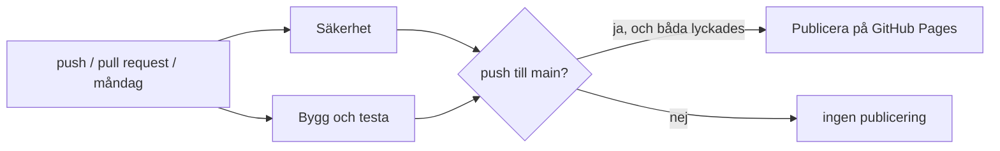

# Bygge, test och publicering

Det här dokumentet beskriver hur sajten byggs, testas och publiceras, och hur
säkerhetskontrollerna fungerar.

## Översikt

Sajten är statisk: en HTML-sida (`index.html`) som i webbläsaren läser in
YAML-filerna i `data/` och renderar tabell och artiklar. Det finns ingen
server och ingen databas. Att bygga betyder bara att lägga ihop rätt filer i
katalogen `_site/` och skriva in ett datum.

Allt körs av ett enda GitHub Actions-workflow, `.github/workflows/pages.yml`.
GitHub Actions är GitHubs tjänst för att köra skript på GitHubs egna maskiner
när något händer i repot. Ett *workflow* består av *jobb*, och varje jobb av
*steg* som körs i ordning på en nystartad virtuell maskin.



Jobben **Säkerhet** och **Bygg och testa** körs parallellt. **Publicera** körs
bara när båda har lyckats och körningen kommer från en push (eller en manuell
start) på grenen `main`.

### När workflowet körs

| Händelse | Säkerhet | Bygg och testa | Publicera |
|---|---|---|---|
| push till `main` | ja | ja | ja, om båda lyckas |
| pull request | ja | ja | nej |
| varje måndag 05:17 UTC | ja | ja | nej |
| manuell start (Actions → Run workflow) | ja | ja | ja, om båda lyckas |

Veckokörningen finns för att nya sårbarheter publiceras även när koden står
still. Den publicerar inget, men misslyckas den syns det under fliken Actions
och GitHub skickar ett mejl.

## Verktyg och beroenden

Alla skript i `scripts/` är Python och körs med
[uv](https://docs.astral.sh/uv/), ett verktyg som installerar Python-paket i en
egen miljö för projektet. Beroendena anges i `pyproject.toml`. De exakta
versionerna, med kontrollsummor, står i `uv.lock` (en *låsfil*). Med `uv run
--locked` vägrar uv att köra om låsfilen inte stämmer med `pyproject.toml`, så
CI använder alltid exakt de versioner som är incheckade.

| Paket | Används till |
|---|---|
| pyyaml | läsa YAML-filerna |
| markdown-it-py | tolka Markdown i kontrollen och formateringstestet |
| tzdata | tidszonen Europe/Stockholm för datumet i fotnoten |
| playwright | styra Chromium i röktestet (bara i utvecklingsgruppen) |
| zizmor | granska workflow-filen (bara i utvecklingsgruppen) |

Sidan själv använder tre JavaScript-bibliotek: js-yaml (läser YAML), marked
(gör HTML av Markdown) och DOMPurify (tar bort farlig HTML innan den visas).
De ligger incheckade i `vendor/` i stället för att hämtas från ett CDN, så att
sidan inte beror på en annan server och så att röktestet kan köras utan nät.
Deras versioner och kontrollsummor står i `vendor/libs.yaml`.

## Jobbet Bygg och testa

Stegen körs i den här ordningen; misslyckas ett steg avbryts jobbet.

1. **Kontrollera datat** – `scripts/check.py`
   - YAML-filerna går att läsa.
   - Varje id består av a–z, 0–9 och bindestreck och börjar med en bokstav, och
     inget id förekommer två gånger.
   - Varje period är en av 1000, 1020, …, 2020.
   - Varje punkt har `label`, och en punkt utan `same_as` har `title` och `text`.
   - Varje `wiki`-post har formen `språk:Artikel`.
   - Varje `same_as` och varje länk `[text](#id)` pekar på ett id som finns, och
     ingen punkt länkar till sig själv.
   - Texten innehåller ingen rå HTML.
   - Textrader längre än 100 tecken (indraget oräknat) ger en *varning* som syns
     vid rätt fil och rad i GitHub, men stoppar inte bygget.
2. **Testa formateringen** – `scripts/test_format.py`
   `scripts/format.py` radbryter texterna vid 70 tecken. Testet kör
   formateringen på allt data och kontrollerar att varje text ger exakt samma
   HTML före och efter (Markdown behandlar en radbrytning inuti ett stycke som
   ett mellanslag), att inga andra fält ändras, att en andra körning inte ändrar
   något och att en rad aldrig börjar med något som Markdown skulle tolka som
   lista, rubrik eller citat (till exempel `-`, `#`, `>` eller `1.`).
3. **Bygg sajten** – `scripts/build.py`
   Kopierar `index.html`, `data/` och `vendor/` till `_site/` och ersätter
   texten mellan `<!--UPDATED-->` och `<!--/UPDATED-->` i fotnoten med tiden för
   senaste commit, i svensk tid. Filen `.nojekyll` gör att GitHub Pages
   publicerar filerna som de är.
4. **Installera Chromium** – den webbläsare som röktestet styr.
5. **Röktest** – `scripts/smoke.py`
   Startar en lokal webbserver för `_site/`, öppnar sidan i Chromium och
   kontrollerar att tabellen visas, att fotnoten har ett datum, att sökningen
   hittar ord både i punkterna och i artiklarna, att en artikel öppnas, att en
   intern länk öppnar en annan artikel och visar tillbaka-knappen, att en adress
   med `#id` öppnar rätt artikel och att inga JavaScript-fel uppstår. Alla
   anrop till andra värdar (typsnitt, Wikipedia) blockeras, så testet beror inte
   på nätet.
6. **Ladda upp** – vid push till `main` packas `_site/` som en *Pages-artefakt*,
   ett arkiv som publiceringsjobbet tar emot.

## Jobbet Publicera

Tar emot artefakten och publicerar den på GitHub Pages med `actions/deploy-pages`.
Jobbet har bara rättigheterna `pages: write` och `id-token: write`. Den senare
låter jobbet visa ett kortlivat identitetsbevis för GitHub Pages (OIDC), så att
inga lösenord eller nycklar behöver sparas i repot.

Repot är inställt på **Settings → Pages → Source: GitHub Actions**.

## Jobbet Säkerhet

### Sårbarheter i Python-beroenden

`uv audit --locked --preview-features audit-command` går igenom varje paket och
version i `uv.lock` och frågar [OSV](https://osv.dev), en öppen databas över
kända sårbarheter som samlar uppgifter från bland annat GitHub Advisory Database
och PyPI. Finns en känd sårbarhet misslyckas steget. Kommandot är en
förhandsfunktion i uv, därav flaggan `--preview-features`.

### Sårbarheter och kontrollsummor för JS-biblioteken

Dependabot och `uv audit` känner inte till filerna i `vendor/`, eftersom de inte
installeras av någon pakethanterare. Därför finns `scripts/audit_vendor.py`:

1. För varje bibliotek i `vendor/libs.yaml` räknas filens sha256 ut och
   jämförs med värdet i `libs.yaml`. Det garanterar att versionsnumret som
   granskas verkligen hör till filen som publiceras; en fil som bytts ut utan
   att `libs.yaml` uppdaterats stoppar bygget.
2. Namn och version skickas till OSV (ekosystemet npm). Varje träff stoppar
   bygget och visas med OSV-id och eventuellt CVE-nummer.
3. Skriptet frågar npm-registret efter senaste version och *varnar* om en nyare
   finns. Varningen stoppar inte bygget.

Så byter man version av ett bibliotek:

```sh
npm pack dompurify@<version>        # eller ladda ner paketet från npm
tar xzf dompurify-<version>.tgz     # filen ligger i package/<source>
cp package/dist/purify.min.js vendor/purify.min.js
sha256sum vendor/purify.min.js      # för in summan och versionen i vendor/libs.yaml
uv run scripts/audit_vendor.py
```

### Granskning av workflow-filen

[zizmor](https://docs.zizmor.sh/) läser workflow-filen och letar efter vanliga
säkerhetsfel i GitHub Actions: för breda rättigheter, möjligheter att injicera
kod via till exempel grennamn, actions som inte är låsta till en viss version,
cachar som kan förgiftas och inloggningsuppgifter som lämnas kvar efter
utcheckningen. Hittar den något misslyckas steget, och fynden visas som
anteckningar i workflow-filen.

Workflowet följer det zizmor kräver:

- Varje action anges med fullständig commit-SHA (`uses: actions/checkout@3d3c…`),
  med versionen som kommentar. En versionstagg som `v7` kan flyttas av den som
  äger actionen; en SHA kan inte det.
- `permissions: {}` på toppnivå, och varje jobb får bara de rättigheter det
  behöver (`contents: read`; publiceringen `pages: write` och `id-token: write`).
- `persist-credentials: false` vid utcheckning, så att GitHub-token inte ligger
  kvar på disk under resten av jobbet.
- Ingen cache för uv, eftersom en cache som delas mellan körningar kan påverka
  ett jobb som publicerar.

### Incheckade hemligheter

[gitleaks](https://github.com/gitleaks/gitleaks) söker med ett par hundra
mönster (API-nycklar, tokens, privata nycklar, lösenord i adresser m.m.) igenom
hela historiken, därför checkas repot ut med `fetch-depth: 0`. Ett fynd stoppar
bygget. Det räcker inte att ta bort hemligheten i en ny commit, eftersom den
finns kvar i historiken. Hemligheten måste också spärras och bytas hos tjänsten
som utfärdade den.

### Dependabot

`.github/dependabot.yml` låter GitHubs Dependabot varje vecka leta efter nyare
versioner av actions och Python-paket och öppna en pull request per grupp.
Pull requesten testas av samma workflow som allt annat, så det syns direkt om
uppdateringen fungerar. Dependabot uppdaterar även SHA:erna för actions.
JS-biblioteken i `vendor/` täcks inte; dem bevakar `audit_vendor.py`.

## Vad som stoppar vad

| Var | Mekanism | Stoppar | Kan förbigås |
|---|---|---|---|
| Din dator, vid commit | pre-commit-hookar | hemligheter (gitleaks), oformaterad text, trasigt data | ja, `git commit --no-verify`; måste aktiveras per klon |
| GitHub, vid push | push protection | kända typer av hemligheter | ja, med angivet skäl; skapar då en varning |
| GitHub, vid merge | ruleset med obligatoriska kontroller | allt som får CI att misslyckas | av administratör, om regeln tillåter |
| GitHub, vid publicering | `needs: [security, build]` | allt som får CI att misslyckas | nej |

**pre-commit.** `.pre-commit-config.yaml` definierar kontroller som körs
innan en commit skapas. De aktiveras en gång per klon med
`uvx pre-commit install`. De körs bara på din egen dator.

**Push protection.** GitHub granskar varje push mot ett publikt repo och
avvisar den om den innehåller en känd typ av hemlighet. Det är påslaget som
standard för personliga konton och kostar inget. Godtyckliga egna kontroller
vid push (så kallade pre-receive hooks) finns bara i GitHub Enterprise Server.

**Ruleset.** Under Settings → Rules → Rulesets kan man kräva att ändringar på
`main` kommer via pull request och att kontrollerna *Säkerhet* och *Bygg och
testa* har lyckats innan de får slås ihop. Då kan trasig kod aldrig hamna på
`main`. Priset är att även ägaren måste arbeta via grenar och pull requests.
Det är inte påslaget i det här repot.

**Publiceringsgrinden.** Även utan ruleset kan en trasig push aldrig nå den
publicerade sajten: publiceringsjobbet körs bara om båda de andra jobben har
lyckats, och den förra versionen ligger kvar tills dess.

## Köra allt lokalt

```sh
uv run scripts/check.py
uv run scripts/test_format.py
uv run scripts/build.py
uv run playwright install chromium     # första gången
uv run scripts/smoke.py
uv run scripts/audit_vendor.py
uv audit --preview-features audit-command
uv run zizmor .github/workflows
uvx pre-commit run --all-files         # gitleaks och de lokala hookarna
```
